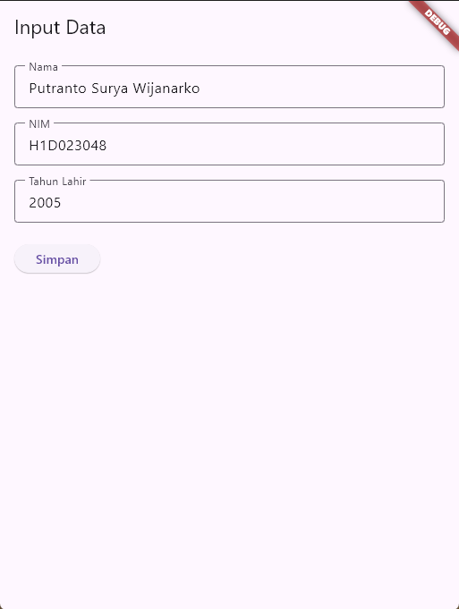
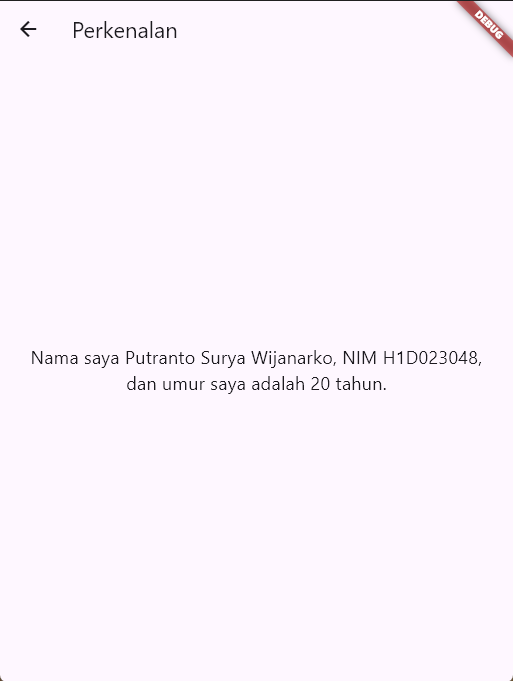

# H1D023048 Tugas 6
## Identitas
Nama : Putranto Surya Wijanarko  
NIM : H1D023048  
Shift Awal & Baru : F  

## Penjelasan
Passing data dari form `form_data` ke `tampil_data` melalui text form dan dikendalikan oleh `TextEditingController`
```dart
final _formKey = GlobalKey<FormState>(); untuk validasi
```
`TextEditingController` akan mengurus keperluan edit dan ambil value, yang nantinya saat pencet simpan akan menavigasi beserta datanya lewat constructor dari widget yang dituju

`tampil_data` menampilkan dari property class nya sendiri yang sudah diisi lewat routing

## Tampilan
Form Data 

Tampil Data  

